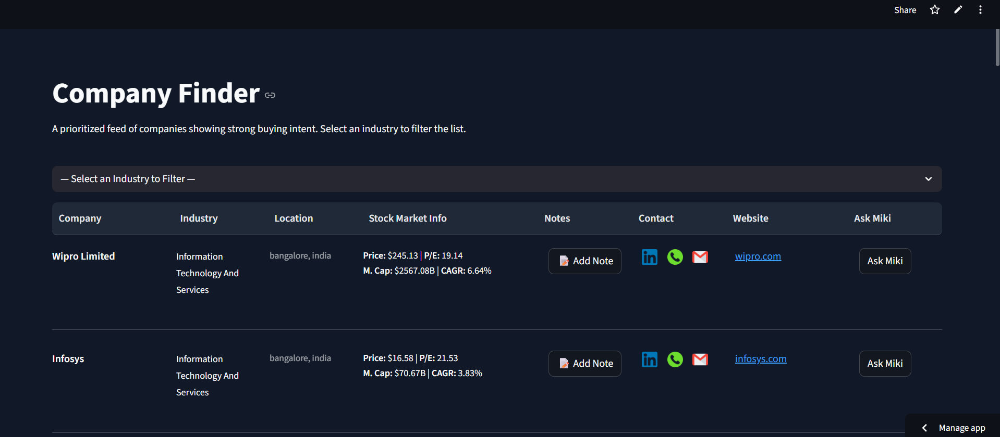

# Company Finder Dashboard

An advanced sales intelligence platform that transforms raw company data into a prioritized, actionable feed. This tool leverages AI to provide deep strategic insights, generate outreach content, and integrate real-time financial and news data, all within a clean, interactive user interface.

---

## 🚀 Live Demo

**[>> Access the live application here <<](https://ai-buying-signals-dashboard-guovm6evzxexnwxnmxmekh.streamlit.app/)**

 

---

## 📸 Application Preview

 

---

## ✨ Key Features
 
### 🤖 AI Co-Pilot ("Miki")
An interactive chatbot designed to be a sales strategist. The interface provides one-click actions and a conversational text input for custom queries.
* **Actionable Insights:** Generates a full strategic plan, including likely pain points, key personas to target, and a core value proposition.
* **AI Email Writer:** Drafts a complete, personalized, and ready-to-send cold outreach email.
* **Live News Feed:** Fetches and summarizes the top 3 latest news articles for any company using a live Google Search.
* **Follow-up Q&A:** Allows for multi-turn, context-aware conversations to refine strategy and ask specific questions.

### 💹 Integrated Financial Intelligence
* For publicly traded companies, the dashboard displays key stock market data directly in the company row.
* Metrics include current stock price, P/E ratio, market capitalization, and the 5-Year Compound Annual Growth Rate (CAGR).
* Data is fetched from Yahoo Finance and cached to ensure a responsive UI.

### 🗒️ Persistent User Notes
* A built-in notepad for every company allows users to add, view, and save their own qualitative insights.
* The button dynamically changes to show whether a note already exists.
* Notes are saved persistently in the database, creating a system of record.

### 🖥️ Interactive & Responsive UI
* Built with Streamlit, the UI is clean, modern, and easy to navigate.
* Features an industry filter to instantly narrow down the list of companies.
* Includes quick-access icons for LinkedIn, email, and phone, plus a direct link to the company website.

---

## 🛠️ Technology Stack

* **Frontend:** Streamlit
* **Backend:** Python 3.9+
* **Database:** SQLite + SQLAlchemy ORM
* **AI & Data APIs:**
    * Google Gemini API (for AI strategy & text generation)
    * Google Custom Search API (for live news)
    * `yfinance` (for stock market data)
* **Data Seeding:** Pandas, Faker
